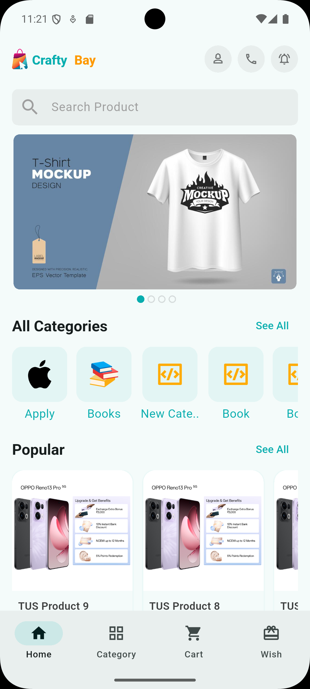
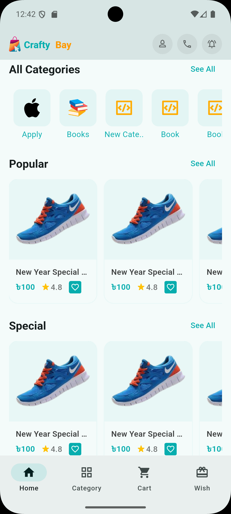
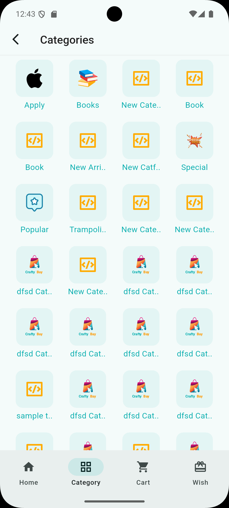
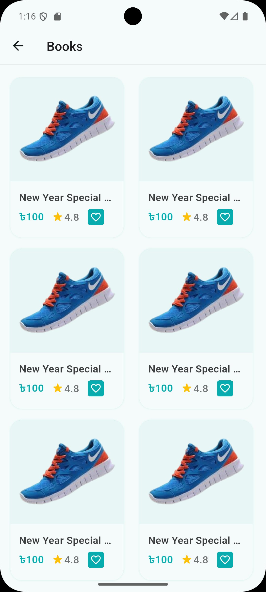
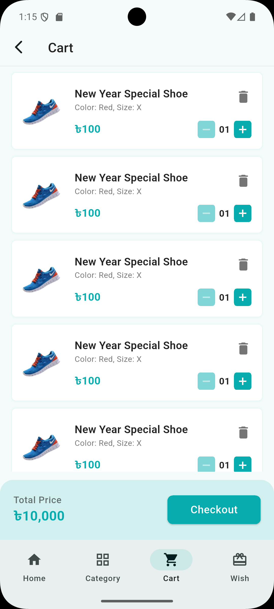
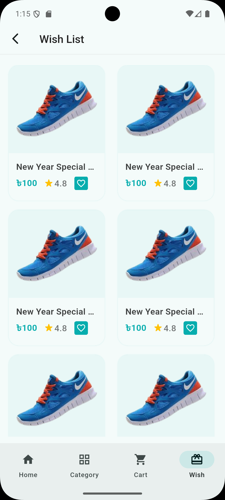
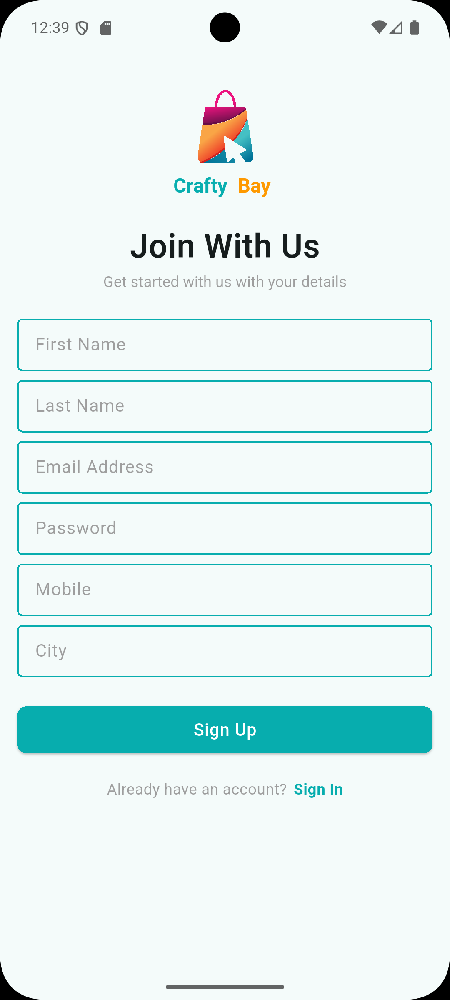
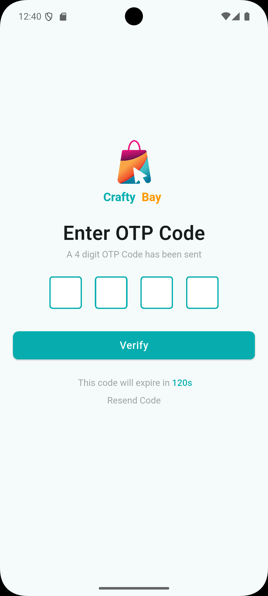

# 🛍️ Crafty Bay

A modern, feature-rich e-commerce mobile application built with Flutter, offering a seamless shopping experience with Firebase integration for crash reporting and analytics.

## ✨ Key Highlights

- 🎯 **Clean Architecture** - Feature-based modular structure
- 🚀 **GetX State Management** - Reactive and efficient state handling
- 🔐 **Secure Authentication** - Email & OTP verification with token-based auth
- 📦 **Pagination Support** - Lazy loading for smooth product browsing
- 🔥 **Firebase Integration** - Crashlytics for monitoring and analytics
- 💳 **Local Currency** - Bangladeshi Taka (৳) with comma separators
- 📱 **Responsive UI** - Material Design with custom theming
- 🛡️ **Error Handling** - Comprehensive error handling with fallback images

## 📥 Download APK

Experience the app without setting up the development environment:

**[📱 Download Android APK](ui_images/app-release.apk)**

*Note: Enable "Install from Unknown Sources" in your Android settings to install the APK.*

## 📑 Table of Contents

- [Key Highlights](#-key-highlights)
- [Download APK](#-download-apk)
- [Features](#-features)
- [Screenshots](#-screenshots)
- [Architecture](#️-architecture)
- [Getting Started](#-getting-started)
- [Dependencies](#-dependencies)
- [Design Patterns](#-design-patterns)
- [Configuration](#-configuration)
- [Supported Platforms](#-supported-platforms)
- [Testing](#-testing)
- [Build](#️-build)
- [API Integration](#-api-integration)
- [Security Features](#-security-features)
- [Error Handling](#-error-handling)
- [Troubleshooting](#-troubleshooting)
- [Roadmap](#️-roadmap)
- [License](#-license)
- [Contributing](#-contributing)
- [Author](#-author)
- [Contact](#-contact)
- [Acknowledgments](#-acknowledgments)

## 📱 Features

### Authentication
- Email & OTP verification system
- Secure user login and registration
- Session management with token-based authentication
- Auto-login with saved credentials

### Product Browsing
- Product catalog with categories
- Category-wise product listing with pagination (lazy loading)
- Product details with image carousel
- Color and size variants selection
- Search bar interface (UI ready)
- Product filtering by category

### Shopping Experience
- Add to cart functionality
- Wishlist/Favorites management
- Special offers section
- New arrivals section
- Popular products section
- Product price display with Bangladeshi Taka (৳) currency

### UI/UX
- Hero banner carousel on home screen
- Smooth animations and transitions
- Responsive design
- Bottom navigation bar with 4 tabs (Home, Category, Cart, Wish)
- Custom app theme with brand colors
- OTP input fields with pin code verification
- Image error handling with fallback
- Loading indicators

### Technical Features
- Firebase Crashlytics for error tracking
- Firebase Core integration
- GetX state management with controller bindings
- RESTful API integration with pagination support
- Image caching and error handling with default fallbacks
- Currency formatting with comma separators (1,000, 10,000)
- Network request handling with custom NetworkClient
- Secure token storage using SharedPreferences
- Logger integration for debugging
- Device preview support for testing

## 📸 Screenshots

<div align="center">
  <table>
    <tr>
      <td></td>
      <td></td>
      <td></td>
    </tr>
    <tr>
      <td align="center"><b>Home Screen</b></td>
      <td align="center"><b>Home Screen 2</b></td>
      <td align="center"><b>Category List</b></td>
    </tr>
    <tr>
      <td></td>
      <td></td>
      <td></td>
    </tr>
    <tr>
      <td align="center"><b>Product List</b></td>
      <td align="center"><b>Shopping Cart</b></td>
      <td align="center"><b>Wishlist</b></td>
    </tr>
    <tr>
      <td></td>
      <td></td>
      <td></td>
    </tr>
    <tr>
      <td align="center"><b>Login Screen</b></td>
      <td align="center"><b>Sign Up Screen</b></td>
      <td align="center"><b>OTP Verification</b></td>
    </tr>
  </table>
</div>

## 🏗️ Architecture

The project follows a clean architecture pattern with feature-based modularization:

```
lib/
├── app/                          # App configuration
│   ├── app.dart                 # Main app widget with GetX configuration
│   ├── app_colors.dart          # Color palette
│   ├── app_theme.dart           # Theme configuration
│   ├── asset_paths.dart         # Asset path constants
│   ├── constants.dart           # App constants (currency, category IDs)
│   ├── controller_binder.dart   # GetX dependency injection
│   └── urls.dart                # API endpoint URLs
├── core/                         # Core utilities
│   └── services/
│       └── network/             # Network layer
│           ├── network_client.dart      # HTTP client wrapper
│           └── network_response.dart    # API response model
├── features/                     # Feature modules
│   ├── auth/                    # Authentication feature
│   │   ├── data/models/        # Auth models (login, signup, OTP)
│   │   └── ui/
│   │       ├── controllers/    # Login, OTP, signup controllers
│   │       ├── screens/        # Auth screens
│   │       └── widgets/        # Auth-specific widgets
│   ├── home/                    # Home screen feature
│   │   ├── data/models/        # Hero banner model
│   │   └── ui/
│   │       ├── controllers/    # Hero banner controller
│   │       ├── screens/        # Home screen
│   │       └── widgets/        # Search bar, banner carousel, etc.
│   ├── product/                 # Product feature
│   │   ├── data/models/        # Product details model
│   │   └── ui/
│   │       ├── controllers/    # Product details controller
│   │       ├── screens/        # Product list, details, category screens
│   │       └── widgets/        # Product-specific widgets
│   ├── cart/                    # Shopping cart feature
│   │   └── ui/screens/         # Cart list screen
│   ├── wish-list/               # Wishlist feature
│   │   └── ui/screens/         # Wish list screen
│   └── common/                  # Shared components
│       ├── data/models/        # Shared models (Category, Product, User)
│       └── ui/
│           ├── controllers/    # Category, Product list, Nav, Auth controllers
│           ├── screens/        # Main bottom navigation
│           └── widgets/        # Reusable widgets (product card, etc.)
├── routes/                       # Navigation routing
│   ├── route_names.dart        # Route name constants
│   └── route_pages.dart        # GetX page routes
├── firebase_options.dart        # Firebase configuration
└── main.dart                    # App entry point
```

## 🚀 Getting Started

### Prerequisites
- Flutter SDK (>=3.10.4)
- Dart SDK (>=3.10.4)
- Android Studio / VS Code with Flutter plugin
- Firebase account (for Crashlytics and Core services)

### Installation

1. **Clone the repository**
   ```bash
   git clone https://github.com/newbie-saimur/crafty-bay.git
   cd crafty-bay
   ```

2. **Install dependencies**
   ```bash
   flutter pub get
   ```

3. **Firebase Setup**
   - Create a Firebase project at [Firebase Console](https://console.firebase.google.com/)
   - Add Android/iOS apps to your Firebase project
   - Download `google-services.json` and place it in `android/app/`
   - Download `GoogleService-Info.plist` and place it in `ios/Runner/` (for iOS)
   - Run Firebase CLI configuration (optional):
     ```bash
     flutterfire configure
     ```
   - Ensure Firebase Crashlytics and Firebase Core are properly configured

4. **Run the app**
   ```bash
   flutter run
   ```

## 📦 Dependencies

### Core
- **flutter_sdk**: Flutter framework
- **get** (^4.7.3): State management and routing with dependency injection
- **http** (^1.6.0): HTTP requests
- **shared_preferences** (^2.5.4): Local storage for token and user data

### UI
- **flutter_svg** (^2.2.3): SVG image support
- **carousel_slider** (^5.1.1): Image carousels for banner and product images
- **pin_code_fields** (^8.0.1): OTP input fields
- **cupertino_icons** (^1.0.8): iOS-style icons

### Utilities
- **intl** (^0.20.2): Internationalization, number formatting, and currency display
- **logger** (^2.6.2): Enhanced logging for debugging

### Firebase
- **firebase_core** (^4.3.0): Firebase initialization
- **firebase_crashlytics** (^5.0.6): Crash reporting and analytics

### Development
- **device_preview** (^1.3.1): Test UI on different devices (currently disabled in production)
- **flutter_lints** (^6.0.0): Linting rules for code quality

## 🎨 Design Patterns

- **State Management**: GetX for reactive state management with `GetxController` and `GetBuilder`
- **Dependency Injection**: GetX bindings for controller lifecycle management
- **Feature-based Architecture**: Modular structure with separate features
- **Observer Pattern**: Reactive UI updates using GetX
- **Singleton Pattern**: NetworkClient and AuthController shared instances
- **Model-View-Controller (MVC)**: Separation of concerns with models, controllers, and UI

## 🔧 Configuration

### API Configuration
Update your API base URL in `lib/app/urls.dart` file to point to your backend server.

### Theme Customization
Modify `lib/app/app_colors.dart` and `lib/app/app_theme.dart` to customize the app's appearance.

### Constants
Update category IDs for special sections in `lib/app/constants.dart`:
- Popular products category ID
- Special products category ID
- New arrival products category ID

### Assets
Place images in `assets/images/` and update `pubspec.yaml` accordingly.

## 📱 Supported Platforms

- ✅ Android
- ✅ iOS

## 🧪 Testing

- ✅ Android
- ✅ iOS

## 🧪 Testing

Run tests with:
```bash
flutter test
```

## 🏗️ Build

### Android
```bash
flutter build apk --release
```

### iOS
```bash
flutter build ios --release
```

## 📝 API Integration

The app integrates with a RESTful API for:
- User authentication (login, registration, OTP verification)
- Product catalog with pagination
- Category listing
- Product details
- Hero banner slider data
- Cart management
- Wishlist management

Key Features:
- Bearer token authentication stored securely in SharedPreferences
- Custom NetworkClient wrapper for all HTTP requests
- Automatic token injection in request headers
- Error handling with fallback messages
- Unauthorized (401) response handling with auto-logout

## 🔐 Security Features

- Token-based authentication
- Automatic session management
- Secure API communication
- Firebase Crashlytics for monitoring
- Error boundary handling

## 🐛 Error Handling

- Network error handling with fallback images
- Firebase Crashlytics integration for crash reporting
- User-friendly error messages
- Null-safety throughout the codebase

## 🔍 Troubleshooting

### Common Issues

**Problem**: App crashes on startup
- **Solution**: Ensure Firebase is properly configured and `google-services.json` is in the correct location

**Problem**: Images not loading
- **Solution**: Check internet connection and API endpoint. Fallback images will display for expired/invalid URLs

**Problem**: OTP not received
- **Solution**: Verify backend API is running and email service is configured

**Problem**: Build errors
- **Solution**: Run `flutter clean && flutter pub get` then rebuild

**Problem**: Network client errors
- **Solution**: Check API base URL in `lib/app/urls.dart` and ensure backend is accessible

### Getting Help

If you encounter issues:
1. Check the [Issues](https://github.com/newbie-saimur/crafty-bay/issues) page
2. Review Firebase Crashlytics logs
3. Enable debug logging in `lib/core/services/network/network_client.dart`

## 🗺️ Roadmap

Future enhancements planned:

- [ ] Product search functionality implementation
- [ ] Product reviews and ratings
- [ ] Order history and tracking
- [ ] Push notifications
- [ ] Multiple payment gateway integration
- [ ] Multi-language support
- [ ] Dark mode theme
- [ ] User profile management
- [ ] Address management
- [ ] Product comparison feature
- [ ] Advanced filtering and sorting
- [ ] Social media sharing
- [ ] Coupon and discount codes

## 📄 License

This project is licensed under the MIT License - see the LICENSE file for details.

## 👥 Contributing

1. Fork the project
2. Create your feature branch (`git checkout -b feature/AmazingFeature`)
3. Commit your changes (`git commit -m 'Add some AmazingFeature'`)
4. Push to the branch (`git push origin feature/AmazingFeature`)
5. Open a Pull Request

## 👨‍💻 Author

**Md Saimur Rahman Robin**

- 🐙 GitHub: [@newbie-saimur](https://github.com/newbie-saimur)
- 💼 LinkedIn: [Saimur Rahman Robin](https://www.linkedin.com/in/saimurrahmanrobin/)
- 📧 Email: [mdsaimurrahmanrobin@gmail.com](mailto:mdsaimurrahmanrobin@gmail.com)

## 📧 Contact

Project Link: [https://github.com/newbie-saimur/crafty-bay](https://github.com/newbie-saimur/crafty-bay)

## 🙏 Acknowledgments

- Flutter team for the amazing framework
- GetX package for state management
- Firebase for backend services
- All open-source contributors

---

**Made with ❤️ using Flutter**

